## Signal peptides


Signal peptides - short, N-terminal sequences directing protein to final destination.

Goals:
* predict 'accurately' presence of signal peptide,
* predict 'accurately' cleavage site.


---

## Signal peptide prediction

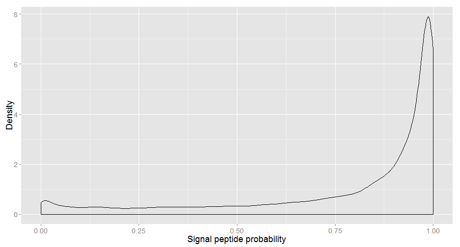 


---

## Signal peptide prediction

<!-- html table generated in R 3.1.2 by xtable 1.7-4 package -->
<!-- Mon Feb 02 03:57:02 2015 -->
<table border=1>
<caption align="bottom"> Probability of detecting signal peptide depends on the cleavage site position. </caption>
<tr> <th>  </th> <th> Probability of signal peptide </th>  </tr>
  <tr> <td align="right"> (6,15] </td> <td align="right"> 0.80 </td> </tr>
  <tr> <td align="right"> (15,24] </td> <td align="right"> 0.84 </td> </tr>
  <tr> <td align="right"> (24,35] </td> <td align="right"> 0.68 </td> </tr>
  <tr> <td align="right"> (35,89] </td> <td align="right"> 0.24 </td> </tr>
   </table>


---

## Cleavage site prediction

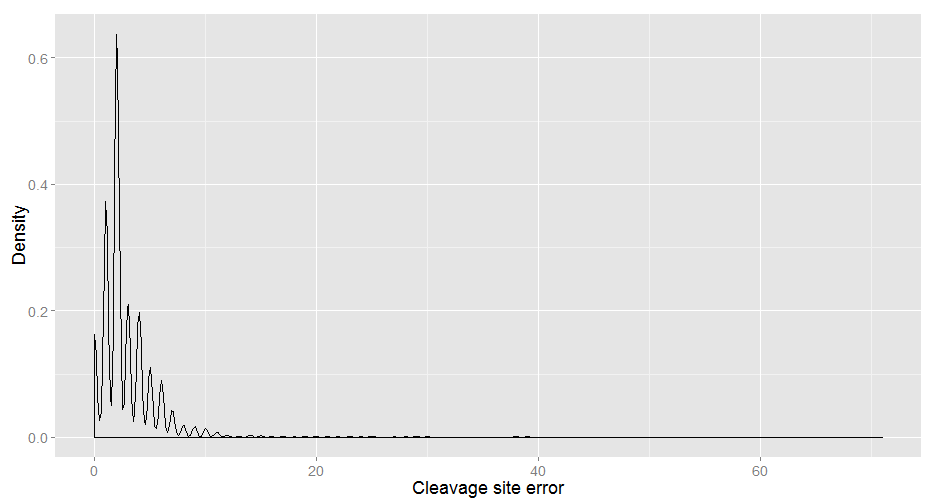 

---

## Cleavage site prediction

Mean cleavage site error: 2.5469 

Median cleavage site error: 2 


---

## Cleavage site prediction - only 'normal' signal peptides

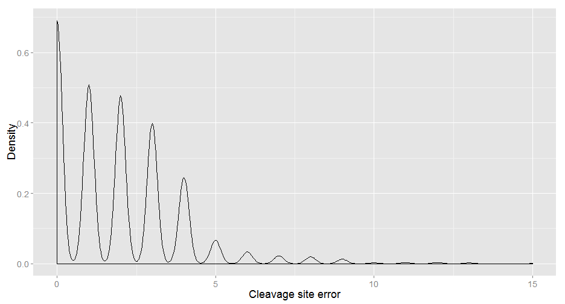 

--- &twocol

## Cleavage site position

*** =left

 

*** =right

<!-- html table generated in R 3.1.2 by xtable 1.7-4 package -->
<!-- Mon Feb 02 03:57:03 2015 -->
<table border=1>
<caption align="bottom"> Number of proteins with given cleavage site position. </caption>
<tr> <th>  </th> <th> Position </th> <th> N </th> <th> prop </th>  </tr>
  <tr> <td align="right"> 1 </td> <td> (6,14] </td> <td align="right">  21 </td> <td align="right"> 0.01 </td> </tr>
  <tr> <td align="right"> 2 </td> <td> (14,36] </td> <td align="right"> 3812 </td> <td align="right"> 0.98 </td> </tr>
  <tr> <td align="right"> 3 </td> <td> (36,89] </td> <td align="right">  64 </td> <td align="right"> 0.02 </td> </tr>
   </table>


--- 

## Standarized frequency

$$latex
\huge{f_s =  \frac{\sum_{i = 1}^{N} 1 - f_{i}}{N}}
$$

$\huge{N}$ - number of proteins  
$\huge{f_i}$ - frequency of a given amino acid in the mature protein

--- 


## Position P-4   

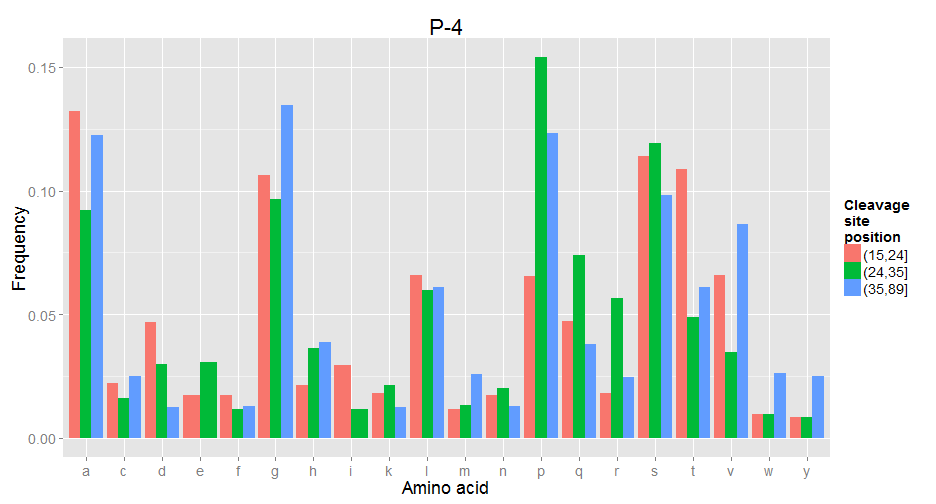 

--- 


## Position P-3   

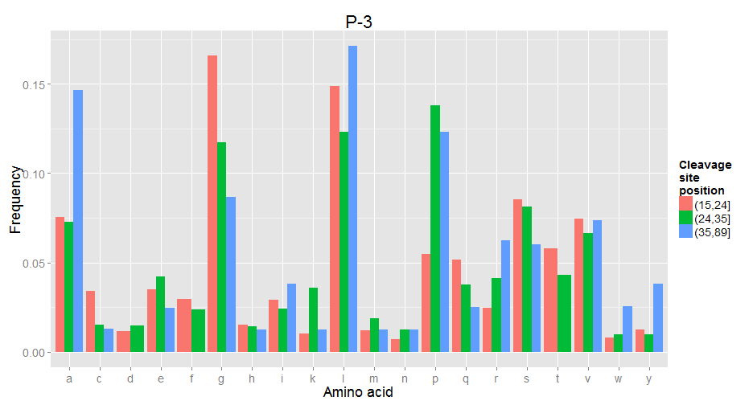 

--- 


## Position P-2   

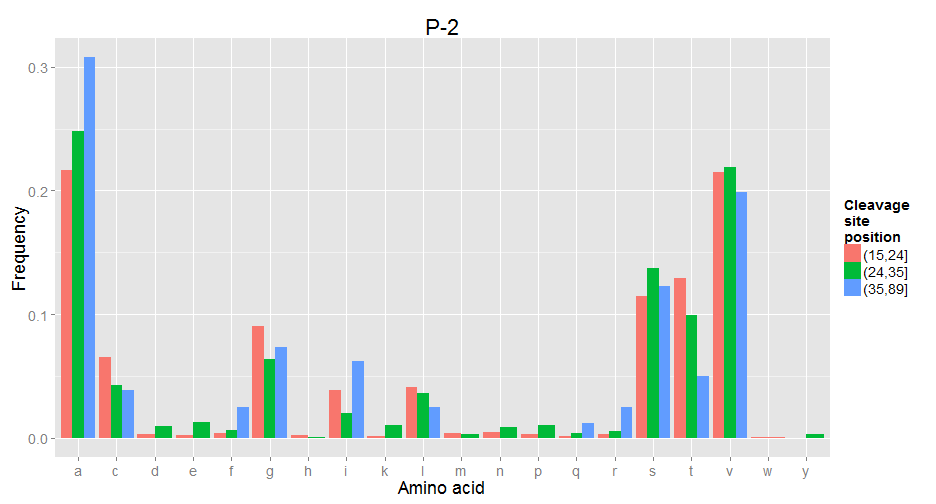 

--- 


## Position P-1   

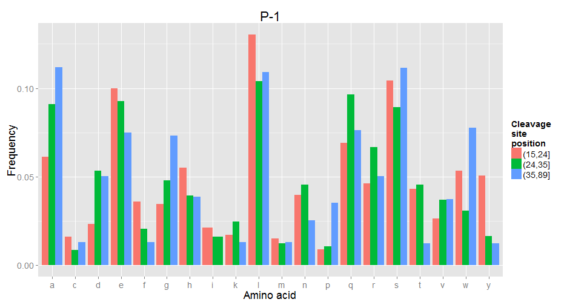 

--- 


## Position P1   

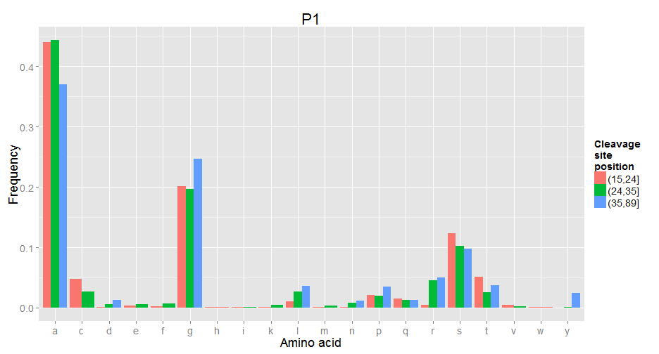 

--- 


## Position P2   

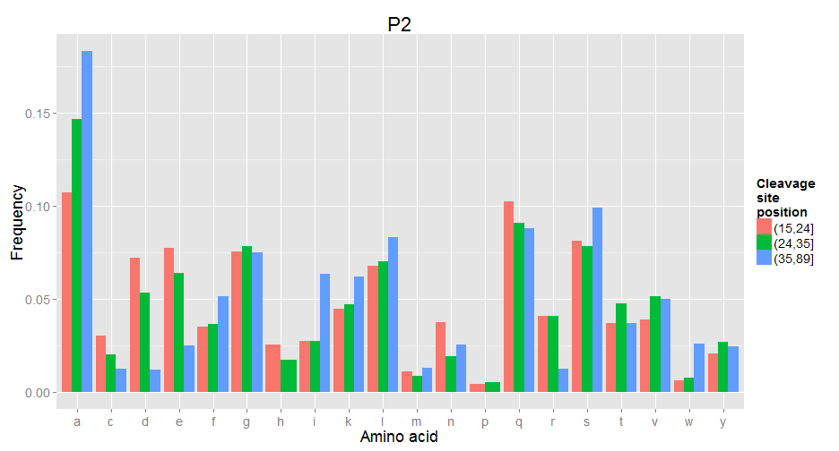 

--- 


## Position P3   

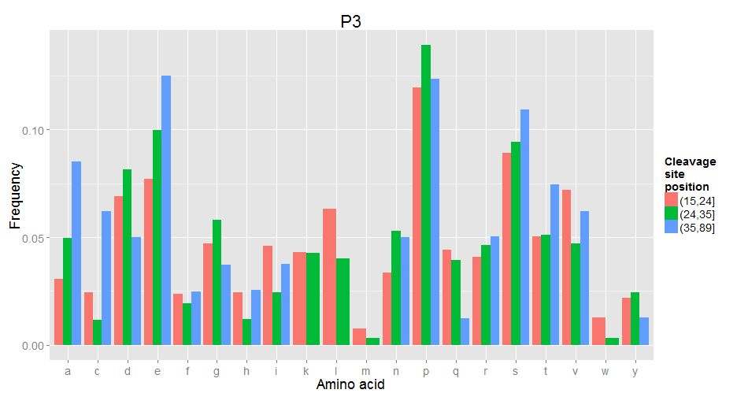 

--- 


## Position P4   

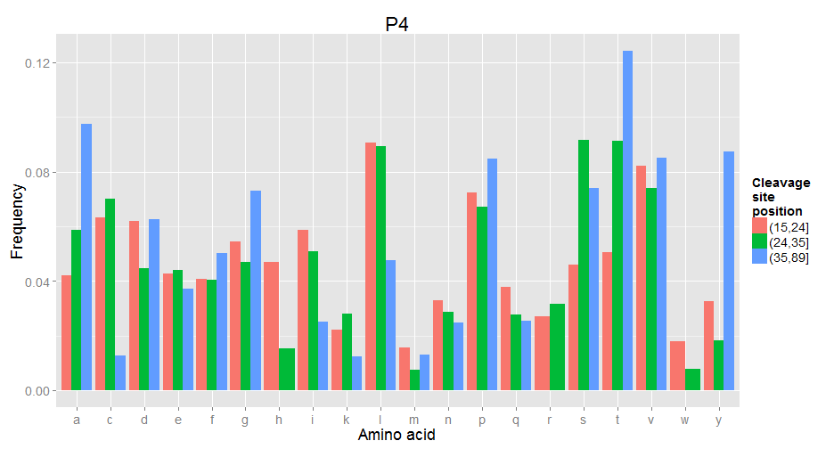 


--- &twocol

## Cleavage site position

*** =left

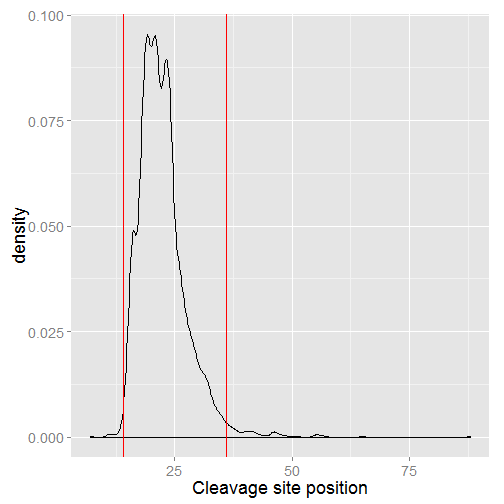 

*** =right

<!-- html table generated in R 3.1.2 by xtable 1.7-4 package -->
<!-- Mon Feb 02 03:57:23 2015 -->
<table border=1>
<caption align="bottom"> Number of proteins with given cleavage site position. </caption>
<tr> <th>  </th> <th> Position </th> <th> N </th> <th> prop </th>  </tr>
  <tr> <td align="right"> 1 </td> <td> (6,14] </td> <td align="right">  21 </td> <td align="right"> 0.01 </td> </tr>
  <tr> <td align="right"> 2 </td> <td> (14,36] </td> <td align="right"> 3812 </td> <td align="right"> 0.98 </td> </tr>
  <tr> <td align="right"> 3 </td> <td> (36,89] </td> <td align="right">  64 </td> <td align="right"> 0.02 </td> </tr>
   </table>


--- 

## Short signal peptides

<!-- html table generated in R 3.1.2 by xtable 1.7-4 package -->
<!-- Mon Feb 02 03:57:23 2015 -->
<table border=1>
<caption align="bottom"> Proteins with short signal peptides. </caption>
<tr> <th>  </th> <th> Position </th> <th> N </th>  </tr>
  <tr> <td align="right"> 1 </td> <td> 7 </td> <td align="right">   1 </td> </tr>
  <tr> <td align="right"> 2 </td> <td> 11 </td> <td align="right">   4 </td> </tr>
  <tr> <td align="right"> 3 </td> <td> 12 </td> <td align="right">   2 </td> </tr>
  <tr> <td align="right"> 4 </td> <td> 13 </td> <td align="right">   3 </td> </tr>
  <tr> <td align="right"> 5 </td> <td> 14 </td> <td align="right">  11 </td> </tr>
   </table>


---

## Signal peptide data

Query used to gather sequences of proteins with signal peptides:

```
select:(keyword:signal) 
AND taxonomy:"Eukaryota [2759]" 
AND created:[1950 TO 2010] 
AND reviewed:yes 
AND annotation:(type:signal confidence:experimental)
```


--- 

## Short signal peptides

<!-- html table generated in R 3.1.2 by xtable 1.7-4 package -->
<!-- Mon Feb 02 03:57:23 2015 -->
<table border=1>
<caption align="bottom"> Verification of short signal peptides. </caption>
<tr> <th>  </th> <th> Experiment </th> <th> N </th>  </tr>
  <tr> <td align="right"> 1 </td> <td> No </td> <td align="right">  14 </td> </tr>
  <tr> <td align="right"> 2 </td> <td> Yes </td> <td align="right">   3 </td> </tr>
  <tr> <td align="right"> 3 </td> <td> Not assessed </td> <td align="right">   4 </td> </tr>
   </table>


--- 

## Short signal peptides

<!-- html table generated in R 3.1.2 by xtable 1.7-4 package -->
<!-- Mon Feb 02 03:57:23 2015 -->
<table border=1>
<caption align="bottom"> Verified signal peptides. </caption>
<tr> <th>  </th> <th> position </th> <th> exp </th>  </tr>
  <tr> <td align="right"> GLU2B_HUMAN </td> <td align="right"> 14 </td> <td> Yes </td> </tr>
  <tr> <td align="right"> GLU2B_MOUSE </td> <td align="right"> 14 </td> <td> Yes </td> </tr>
  <tr> <td align="right"> ICIW_WHEAT </td> <td align="right"> 12 </td> <td> Not assessed </td> </tr>
  <tr> <td align="right"> LIP2_CANRU </td> <td align="right"> 14 </td> <td> Not assessed </td> </tr>
  <tr> <td align="right"> PLSC_PHYPO </td> <td align="right"> 14 </td> <td> Not assessed </td> </tr>
  <tr> <td align="right"> SCX9_MESMA </td> <td align="right"> 14 </td> <td> Not assessed </td> </tr>
  <tr> <td align="right"> VSI2_TRYBB </td> <td align="right"> 12 </td> <td> Yes </td> </tr>
   </table>

--- 

## Conclusions and perspectives

1. Verify long signal peptides.  
2. Investigate diffrences between shorter normal peptides and longer normal peptides.  
3. Separate between HSMM for shorter and longer signal peptides.  
